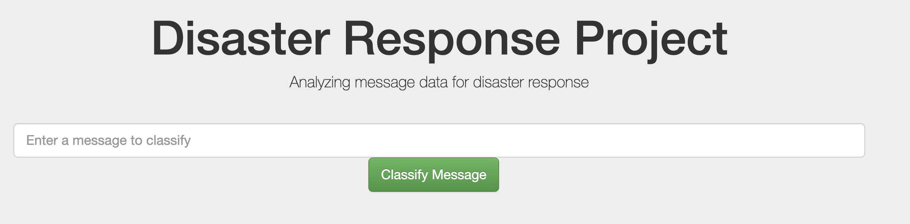
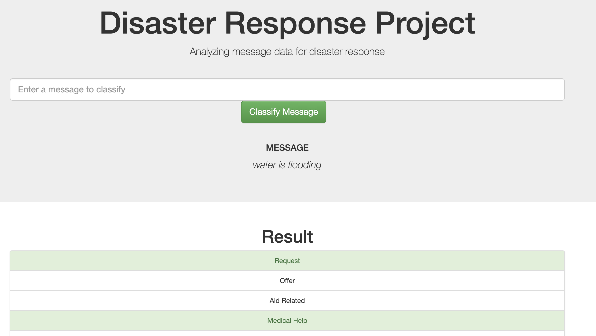
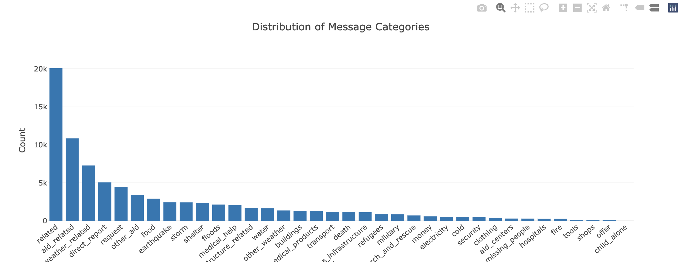

# Disaster Response Pipeline and Web App
- [Project Overview](#Project-Overview)
- [Installation](#Installation)
- [Project Components](#Components)
- [Instructions](#How-To-Run-This-Project)
- [Licensing, Authors, Acknowledgements](#License)

## Project Overview <a name="Project-Overview"></a>
The Disaster Response Pipeline project is part of the Udacity Data Science Nano degree in partnership with Figure Eight. This project builds a natural language processing (NLP) pipeline that categorizes disaster messages into different categories. The project also provides a web application for the visualization.


**The goal** of this project is to build an NLP pipeline that processes the text data and performs multi-output classification on 36 categories. Finally, a web app built from Flask will display some visualization about data, take in new messages and classify their categories.

## Installation <a name="Installation"></a>
```
pip install -r requirements.txt
```

## Project Components <a name="Components"></a>
There are 3 main components in this project.
### 1. ETL pipeline
- Load two datasets
- Merge the sets and clean the data
- Store the data in a SQLite database

### 2. ML pipeline
- Load the clean data from the SQLite database
- Split the data to train-test sets
- Build a text processing and machine learning model with NLTK
- Train the model
- Evaluate the model
- Export the final model using joblib module

### 3. Flask Web App
A web application displays some visualization about the dataset. Users can type in any new messages in the web app and receive the categories that the message may belong to.


Figure 1. Input field takes in new messages.


Figure 2. An example message _"Water is flooding "_ is classified in the following categories: request, medical help.


Figure 3. Distribution of 36 classes. The data is clearly imbalanced, and 'Related' is the highest.


## Instructions <a name="How-To-Run-This-Project"></a>
### 1. Download the files or clone this repository
  ```
  git clone https://github.com/jsrimr/Disaster-Response-ML-and-Web-App
  ```
### 2. Execute the scripts
a. Open a terminal <br>
b. Direct to the project's root directory <br>
c. Run the following commands: <br>
- To run ETL pipeline that cleans data and stores in database
  ```
  python data/process_data.py data/disaster_messages.csv data/disaster_categories.csv data/DisasterResponse.db
  ```
- To run ML pipeline that trains classifier and saves
  ```
  python models/train_classifier.py data/DisasterResponse.db models/classifier.pkl
  ```

d. Go to the app's directory and run the command
```sh
cd app
python run.py
```

## Licensing, Authors, Acknowledgements <a name="License"></a>
* [Figure Eight](https://www.figure-eight.com/) for providing the datasets and directions
* [Udacity](https://www.udacity.com/) for project goal

